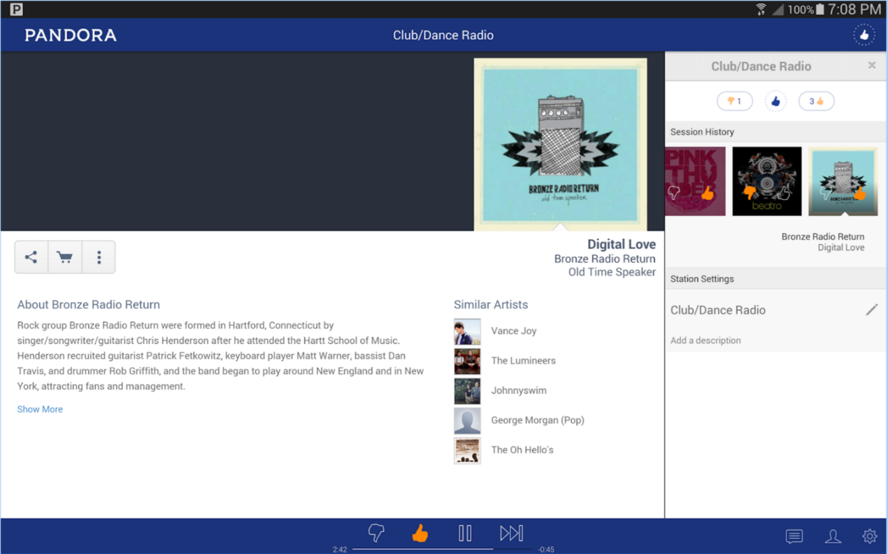
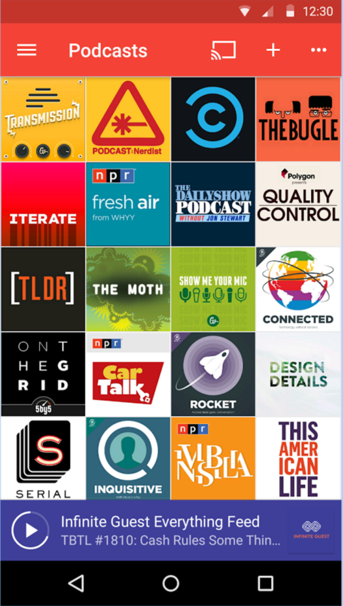
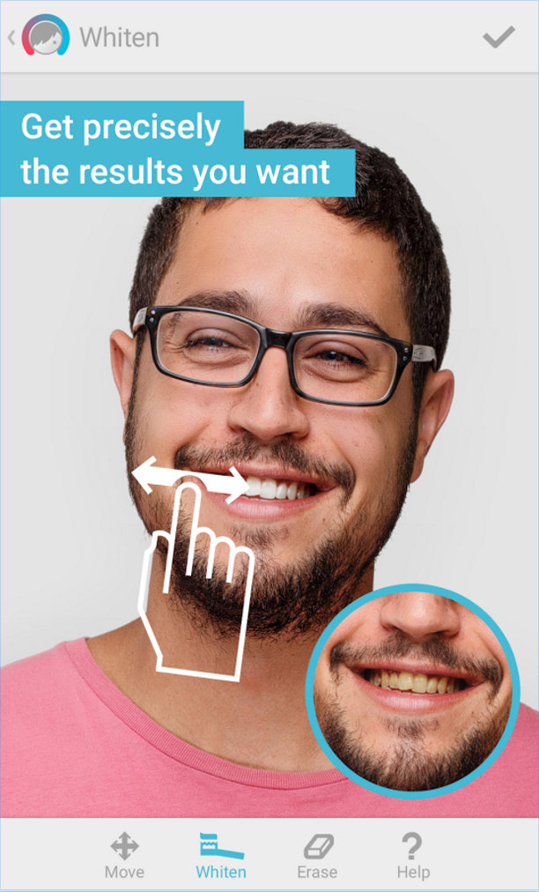
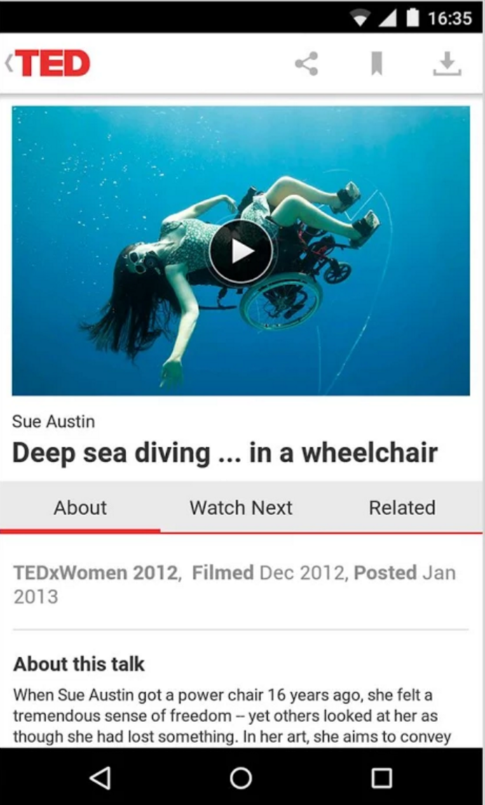

#  Toolbars and Menus Lab

## Introduction

> ***Note:*** _This can be a pair programming activity or done independently._

It's time to practice your newly found Toolbars skills! Many apps we use every day implement Toolbars in different ways. You are going to be choosing two apps from the screenshots below, and re-create the design of **the toolbars only**. Don't worry about the rest of the content on the screen.

If the item in the Toolbar is supposed to react to user interaction, make sure your app does something to acknowledge that the user pressed it.

**Pandora**

**PocketCasts**

**Facetune**

**TED**

## Exercise

#### Requirements

- Recreate the toolbars of two screenshots
- All interactive elements in the toolbars should respond to user interaction in some manner

**Bonus:**
- Implement the remaining app choices

#### Deliverable

One app per chosen screenshot that has the Toolbar UI implemented.

## Additional Resources

- [Toolbars](http://developer.android.com/training/appbar/index.html)
